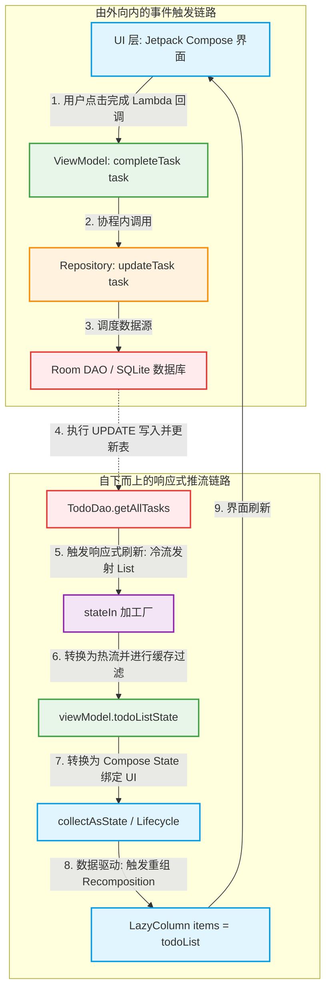

# Doplusplus

本项目为**REDROCK**移动部门五一考核项目

DoPlusplus是一款基于 Jetpack Compose 开发的轻量级待办App。

------

## 核心特性

- **今日**页面：快速预览今日截止的待办事项
- **待办**页面：快速添加、删除、查看、修改待办事项
- **我的**页面：账户和软件设置相关

------

## 技术栈

- **开发语言**：Kotlin
- **框架**：Jetpack Compose
- **设计模式**：MVVM

------------以下是开发中的一些收获------------

### 关于数据存储：

一个完成任务的操作是如何触发的？ 我们从外向内看

```kotlin
LazyColumn(  
    verticalArrangement = Arrangement.spacedBy(8.dp),  
    modifier = Modifier.fillMaxWidth()  
) {  
    items(items = todoList, key = { it.taskID }) { task ->  
        //https://developer.android.google.cn/develop/ui/compose/touch-input/user-interactions/swipe-to-dismiss?hl=zh-cn  
  
        ListCard(  
            task = task,  
            onCheckedChange = { viewModel.completeTask(task) },  
            onRemove = { viewModel.deleteTask(task) }  
        )  
    }  
  
}
```

注意到，items = todoList，又发现：

```kotlin
val todoList by viewModel.todoListState.collectAsState()
```

他其实等价于：

```kotlin
val todoListState: State<List<TodoTask>> = viewModel.todoListState.collectAsState() // 读取时需要显式调用 .value LazyColumn { items(todoListState.value) { ... } }
```

我们在screen里，将todoListState collectAsState，那么继续看todoListState

```kotlin
val todoListState: StateFlow<List<TodoTask>> = todoRepository.allTasks  
    .stateIn(  
        scope = viewModelScope,  
        started = SharingStarted.WhileSubscribed(5000),  
        initialValue = emptyList()  
    )
```

发现：todoRepository.allTasks的类型其实是Flow<List>

那么先理解stateIn：他是一个拓展函数，可以把冷流转换为热流 具体而言：在后台创建一个带有缓冲区的“热流”对象（通常是 ReadonlyStateFlow），利用 scope 启动一个后台协程，去 collect（收集）上游的冷流，根据 started 策略，在没有订阅者时，控制后台协程的暂停与恢复，然后返回这个热流对象

接下来看todoRepository.allTasks，也就是repository中的方法。

```kotlin
class TodoRepository(private val todoDao: TodoDao) {
    val allTasks: Flow<List<TodoTask>> = todoDao.getAllTasks()
```

接着看todoDao的结构

```kotlin
@Query("SELECT * FROM todo_database ORDER BY taskCreateDate DESC")
    fun getAllTasks(): Flow<List<TodoTask>>
```

我们看到了一个返回Flow<List>的方法。也就是repository里的allTasks

注意，他是一个flow，而且是一个冷流，也就意味着他其实是数据源，是一个**不生产数据、也不消耗资源**的流，只有当有“消费者”开始调用 `collect()` 连上它时，它才会开始执行内部的代码并生产数据。

`allTasks` 就是 `stateIn` 的**上游**。数据是从 `allTasks`（上游）流向 `stateIn`（下游）的

而热流，不管有没有人在看（订阅），它**都在后台持续运行、生产数据并持有最新的状态**。它可以同时有很多个订阅者。回到上面那个代码，StateFlow就是热流，是通过alltasks.stateIn转换出的

同时注意，stateIn会调用collect，把他自己变成StateFlow<List>，然后todoListState.collectAsState()，把里面的 `List<TodoTask>` 拿出来

也就是说这个todoList会随着热流自己变化，把他直接items = todoList之后，UI就成为了数据的映射

流程：



### 演示GIF
功能尚不完善，本GIF功能是2026年7月6日的状态，后续还会继续完善该项目

### 待完成

- [ ] 实现完整登录功能

- [ ] 实现“今日”功能

- [ ] 为任务提供更多的可调整属性

### 一些感想

与过去的传统方式开发不同，Kotlin+Compose开发使得流程变得更加容易，Kotlin是语言层面上的，它会比Java简洁许多，而Compose用下来最大的感受就是完全数据驱动和声明式UI，非常优雅的解决了状态同步的问题；并且，由于没有XML文件，代码量也减少了，逻辑和结构得到了统一

同时 由于Flow的存在，它可以非常容易地转化为compose能够识别的“状态”

```kotlin
val uiState by viewModel.uiState.collectAsStateWithLifecycle()
```

这样的写法也为开发带来了很大的便利
